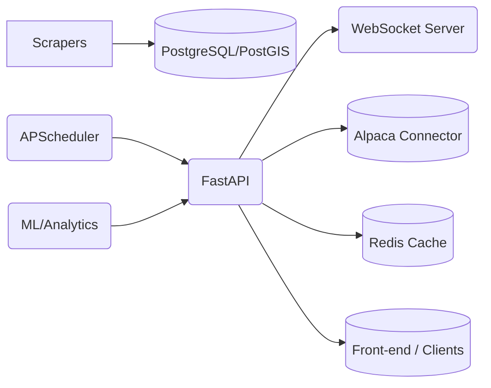

# Portfolio Allocation System (PAS): Automated strategy allocation, execution, and analytics.

## 1. Project Overview
### Name & Tagline
**Portfolio Allocation System (PAS):** Automated strategy allocation, execution, and analytics.

### Purpose & Scope
Real-time weight calculation, rebalancing via Alpaca, historical analytics, and live data streams.

### Key Features
- Automated scheduling (APScheduler)
- Generic `/db/{table}` REST proxy
- Correlation & sector-exposure analytics endpoints
- On-demand execution endpoints & WebSocket feeds
- Built-in Prometheus metrics & dashboard UI

## 2. Architecture Diagram & Components
### High-Level Diagram


### Data Flow
- Data Ingestion → Postgres/PostGIS
- APScheduler Jobs → Allocation & Execution
- REST & WS → Front-end/Clients

### Technology Stack
- FastAPI, SQLAlchemy, APScheduler
- PostgreSQL (+ PostGIS), Redis cache
- Python 3.10+, Docker, Kubernetes
- Prometheus + Grafana for monitoring

## 3. Prerequisites & System Requirements
### Languages & Tools
- Python ≥ 3.10
- Docker ≥ 20.10
- Kubernetes (optional)

### Services
- PostgreSQL 14+
- Redis ≥ 6.x
- Alpaca account (paper/live)

### External APIs
- Alpaca trading API
- optional CSO/Daft/MyHome data sources

## 4. Getting Started / Local Development
### 4.1 Clone & Checkout
```bash
git clone git@github.com:KilianC3/Portfolio_Allocation_System.git
cd Portfolio_Allocation_System
```

### 4.2 Environment Variables
Configure `.env` or `config.yaml` with:

- `API_TOKEN` – your secret bearer token
- `DATABASE_URL` – Postgres connection string
- `REDIS_URL` – Redis connection string
- `ALPACA_API_KEY` / `ALPACA_SECRET_KEY`
- `CORS_ALLOW_ORIGINS` – front-end host(s)
- Optional: `SUPABASE_URL` / `SUPABASE_KEY`

### 4.3 Build & Run with Docker
```bash
docker-compose up --build
```
Services spun up: api, db, redis, scheduler, prometheus.

Browser auto-opens <http://localhost:8000/dashboard>

## 5. Configuration & Customization
### Scheduler Settings (`apscheduler.yaml`)
- Job intervals
- Retry policies

### Database Migrations
- Alembic commands for schema changes

### Logging & Verbosity
- ENV flags: `LOG_LEVEL`, log format

### Feature Flags
- Toggle analytics endpoints or sandbox/live execution

## 6. API Reference
### 6.1 Authentication
Use the `Authorization: Bearer <API_TOKEN>` header or a `?token=` query parameter.

Error codes: 401 Unauthorized, 403 Forbidden

### 6.2 Core Endpoints
**Generic DB Proxy**
- `GET /db/{table}`
- Parameters: `limit`, `offset`, column filtering
- Example:
```bash
curl -H "Authorization: Bearer $API_TOKEN" \
     "http://localhost:8000/db/portfolio?limit=10"
```
Response:
```json
[{"symbol": "AAPL", "weight": 0.1, "as_of": "2024-01-05"}]
```

**Analytics**
- `GET /correlation?strategy1=&strategy2=&window=`
```bash
curl "http://localhost:8000/correlation?strategy1=beta&strategy2=gamma&window=60&token=$API_TOKEN"
```
Response:
```json
{"correlation": 0.42}
```
- `GET /sector-exposure?strategy=`
```bash
curl "http://localhost:8000/sector-exposure?strategy=beta&token=$API_TOKEN"
```
Response:
```json
{"technology": 0.35, "healthcare": 0.1}
```

**Execution**
- `POST /execute/rebalance`
```bash
curl -X POST -H "Authorization: Bearer $API_TOKEN" \
     http://localhost:8000/execute/rebalance
```
Response:
```json
{"orders_submitted": true}
```
- `GET /execute/trades?limit=&offset=`
- `GET /execute/account`

**Dashboard & Docs**
- `GET /dashboard`
- `GET /docs`, `/redoc`, `/openapi.json`

**Metrics**
- `GET /metrics` (Prometheus format)

## 7. WebSocket Streams
- URL: `ws://<host>/ws/{channel}`
- Channels & Message Schemas
  - `price-ticks`: `{ "symbol": string, "price": number, "timestamp": ISO }`
  - `fills`: `{ "order_id": string, "symbol": string, "qty": number, "side": string, "price": number, "timestamp": ISO }`
  - `equity`: `{ "strategy": string, "equity": number, "timestamp": ISO }`

## 8. Monitoring & Health Checks
- **Prometheus Metrics**: scrape interval, sample metrics (API request rate, scheduler job duration)
- **Alerting**: Grafana dashboards and alert rules on job failures or latencies
- **Self-Check Endpoint**: `GET /health` → `"OK"`

## 9. Testing & Quality Assurance
- **Unit Tests**: `pytest -q` target structure and coverage
- **Integration Tests**: `docker-compose -f docker-compose.test.yml up`
- **Linting & Formatting**: `flake8`, `black`, `isort`

## 10. Deployment
- **CI/CD Pipeline**: GitHub Actions builds, lints, tests and publishes Docker image
- **Staging vs Production**: environment overrides, secret management (Vault / GitHub Secrets)
- **Kubernetes Manifests**: `deployment.yaml`, `service.yaml`, HPA settings
- **Rollback Strategy**: image tagging, database migration rollbacks

## 11. Security & Best Practices
- Secret Management: don’t commit tokens; use vaults or secrets manager
- Rate-Limiting & Throttling (if needed)
- Dependency Updates: Dependabot configuration
- GDPR / Data Privacy: how you store or purge sensitive logs

## 12. Contributing & Roadmap
- **How to Propose Changes**: branching, PR conventions, code review checklist
- **Feature Requests & Issues**: GitHub Issues template
- **Future Enhancements**: planned analytics (e.g. ML-driven alpha signals), multi-broker support, plugin hooks

## 13. License & Acknowledgments
- **License**: MIT
- **Third-Party Libraries**: attribution for FastAPI, APScheduler, SQLAlchemy, Prometheus, etc.
